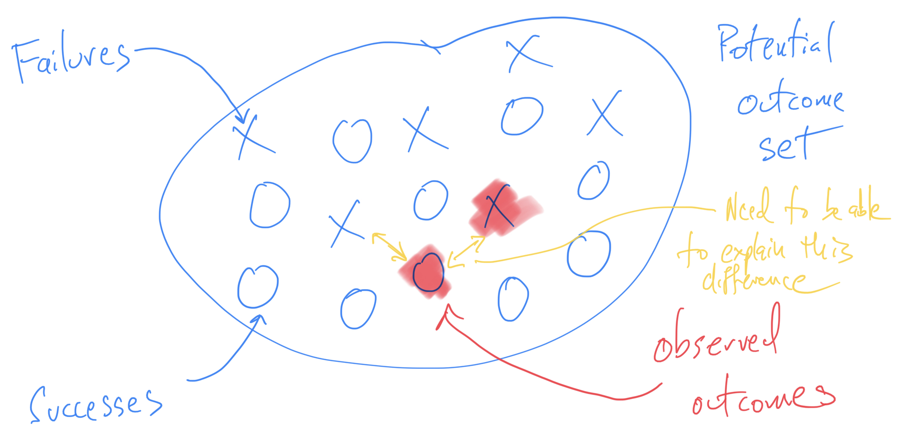

What does it mean for a data analysis to fail? I’ve come to feel that this is an important question because considering the ways that data analyses can fail is a good way to prevent an analysis from actually failing. However, thinking about the ways an analysis can fail is easier said than done. It requires an active imagination, an ability to think about what *might* happen or what *might have* happened. It requires thinking about what was *not* observed rather than what was observed.

One thing to clarify here is that when I think of failure, I think of something that is more or less immediately observable. So once you’ve done the analysis, you know whether you’ve failed or not. This rules out a number of possibilities that I think people are used to thinking about. For example, it rules out the question of whether the claims of an analysis are true or not. Often, it is not possible to determine the truth of an analysis until much later. It also rules out considerations of replication or reproducibility because both of those require future analyses to be done. Therefore, I’m not going to consider these ideas for now and focus on what we as analysts can do in the moment.

An analysis failure, broadly speaking, is any outcome that does not meet our expectations. This might sound like a bit of an anti-climactic definition of “failure” but ultimately such an outcome represents a failure of our understanding about something: the data (and data generation process), the methods, or the science. As a result, a success is any outcome that is as-expected. That also seems like a bit of low bar for success, but we can make other distinctions later regarding whether a success is good or not.

## Types of Failure

My taxonomy of failure falls into two large bins:

* **Verification failure**: This is a narrow class a failure when an analysis produces an outcome that is counter to our expectation in any way. If we are expecting a correlation coefficient to be between 0.4 and 0.6 and we compute a correlation coefficient that is actually 0.1, then that is a verification failure. This failure indicates that there is something we don’t quite understand about the underlying correlation or the data.
* **Validation failure**: This is a broader class of failure that includes considerations that are outside the data. Validation failure is typically a result of a poor design process for the analysis that results in flawed requirements. For example, if we are interested in the association between predictor X and outcome Y adjusted for Z, but we build a prediction model for Y that omits Z, then this is a validation failure. The prediction model may operate as-expected and do a good job of predicting Y, but it doesn’t answer the question of whether X and Y are associated adjusted for Z.

I find a simple non-data related example can be helpful. A person can ask an architect to design a house with no roof. If the architect builds the house, then the finished house meets expectations from a verification standpoint. It is a verification success. However, when it rains and the inside of the house gets wet, that is a validation failure.

This failure can be traced back to the design process and the setting of the requirements for the project. The actual building of the house went without a hitch. So how could the failure be prevented?

One possibility is the architect could have pushed back and argued that a house with no roof is a bad idea and is therefore a bad requirement (and probably against local code). The architect might have even refused to build the house. Or the architect could simply ask why the person doesn’t want a roof. If it turned out that the person simply wanted a lot of light in the house, then a different requirement could be specified, like a glass roof, that might satisfy everyone’s needs.

In general, I think the things we teach about statistics and data analysis in the classroom (textbook knowledge, so to speak) are focused around preventing verification failure. Given a set of requirements, we’d like people to know how to build the widget with the right tools and to be knowledgeable about the assumptions they are making. In my experience, the things that are taught “outside the classroom” are focused on preventing validation failure. Here, we want people to know whether they are building something useful and not simply building something that is “correct”.

## Potential Outcomes for Analysis

Statisticians like to talk about data analysis failure because it’s a little like Monday morning quarterbacking. It’s often easy to recognize a failure after the analysis is done. But what about *before* the analysis is done? 

Catching a failure before it happens requires an understanding of the *potential outcomes* of an analysis. Most data analysis problems will admit a range of possible analysis plans and it is up to the analyst to choose one. Given an analysis plan, there is then a set of potential outcomes that this plan can produce before it is applied to the data. Once we apply the plan to the data, we will observe one of these potential outcomes.

For example, if our analysis is to take the arithmetic mean of a set of numbers, the set of potential outcomes is some subset of the real line. If we are making a scatter plot of two continuous variables, then our set of potential outcomes is the set of all possible scatter plots of two variables. Clearly, the second example with the scatter plot is harder to characterize than the first. But most analysts will intuitively understand what this set looks like.

Once we can characterize the set of potential outcomes, we can divide that set into two broad regions: expected outcomes and unexpected outcomes. When we apply our analysis plan to the data, the outcome will fall in one of these two regions. Outcomes that fall into the “unexpected” region are what I am characterizing as failures here.

Continuing our two examples from above, for the mean we might expect that the outcome will fall into the interval [3, 7]. If the observed mean ended up being 10, that would be unexpected. If it were 4 then that would be as-expected. For the scatter plot, if we believed the two variables were positively correlated, then we might expect the scatter plot to look like a nice cluster of dots shaped like a “football” (American, that is) leaning at roughly a 45 degree angle. If the actual scatter plot looked like a circle (i.e. no correlation) or maybe a circle with a large outlier to the right, that would be unexpected.

## Going From Success to Failure

The traditional notions of success and failure would seem to suggest that we should favor success over failure. But in the data analysis context, what we need to consider is how an analysis can go from success to failure and vice versa. If an analysis outcome is a success and is as-expected, it is important to ask “How could this have failed?” If an analysis outcome is a failure and is unexpected, it is important to ask “How could this have succeeded?” 

There is therefore a common task when it comes to the observed output of a data analysis, regardless of whether it could be considered a success or a failure. That task is to consider the entire potential outcome set (given the chosen plan) and determine what could cause one to observe a different outcome than what was actually observed.

In the case of failure, this scenario is a bit easier to understand. When one observes an unexpected outcome, usually one is highly incentivized to get to the bottom of what caused that to occur. It might have been an error in the dataset, or a problem in the data wrangling, or a misunderstanding of how the methods or software work. Finally, there might have been a misunderstanding in our expectation (i.e. in the underlying science) and that perhaps this outcome should have been expected.

In the case of success, it is critical that we apply essentially the same thinking, especially in the early stages of analysis. We should be getting to the bottom of what caused this (success) to occur. In this case, it is still possible to ask whether their might have been an error in the dataset, or a problem in the wrangling, or a misunderstanding of the methods, software or underlying science. In the case of success, it is sometimes valuable to ask what would happen if we *induced* some sort of problem, like an error in the dataset, or an outlier, or a mis-applied statistical model (sometimes this is called sensitivity analysis).

In both success and failure it is valuable to consider the unobserved outcomes in the potential outcome set and ask whether we actually should be observing one of those other outcomes, perhaps because there exists a better model or because the data should be processed in a different way. It is this consideration of the potential outcomes of an analysis, as well as the alternating between success and failure, that drives the iterative nature of data analysis. Ultimately, we want to come to a place where we feel we understand the data, the data generation process, and the analytic process that leads to our result.

## Generalizing From Failure 

When I hear people (including myself) say that data analysis is learned through experience, I realize now that what we mean is that experience is what allows one to build up that active imagination of what *could* happen. Producing the observed data analytic outcome requires skills-—fitting statistical models, data wrangling, visualization—-that can largely be taught in the classroom. But building the set of potential outcomes becomes easier and faster with experience as we observe more outcomes in other data analyses. 

The way that we generalize our experience across different data analyses is to enrich and expand our set of potential outcomes for use in future analyses. What was once unexpected now becomes somewhat as-expected. And because such outcomes are expected, we know to watch out for them and we learn the techniques for checking on them.

But there is another way that we can “learn from experience” that has the potential to take a lot less time——collaborating with other people. Other people may have more experience or they may have different experience. Combining people with different experiences on the same analysis can produce a similar effect to a single person having more experience. Each person has seen different outcomes in their past and together they can produce a potential outcome set that is much larger than they could produce on their own. In this way, people can gain “experience” by working together. And the more diverse the experiences of the individual collaborators, the richer and larger the potential outcome set will be that they can construct and imagine.
